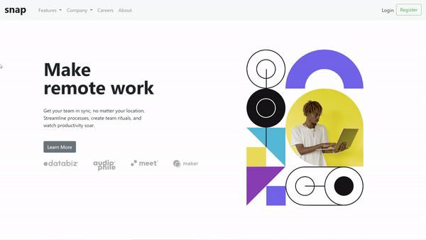
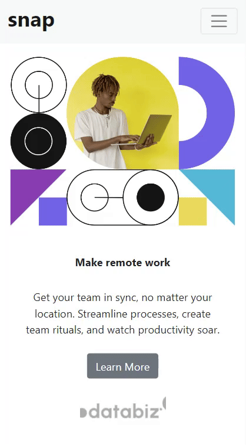

# Frontend Mentor - Intro section with dropdown navigation solution

This is a solution to the [Intro section with dropdown navigation challenge on Frontend Mentor](https://www.frontendmentor.io/challenges/intro-section-with-dropdown-navigation-ryaPetHE5). Frontend Mentor challenges help you improve your coding skills by building realistic projects. 

## Table of contents

- [Overview](#overview)
  - [The challenge](#the-challenge)
  - [Screenshot](#screenshot)
- [My process](#my-process)
  - [Built with](#built-with)
  - [Continued development](#continued-development)
  - [Useful resources](#useful-resources)
- [Author](#author)
- [Acknowledgments](#acknowledgments)

## Overview

### The challenge

Users should be able to:

- View the relevant dropdown menus on desktop and mobile when interacting with the navigation links
- View the optimal layout for the content depending on their device's screen size
- See hover states for all interactive elements on the page

### Screenshot
> **Desktop View**

  

 

> **Mobile View**

  

## My process

### Built with

- Semantic HTML5 markup
- CSS custom properties
- Flexbox
- Bootstrap

### Continued development

This project does not involve any logical part, so I wish to work on the backend part in near future. 

### Useful resources

- [Bootstrap Library](https://getbootstrap.com/docs/4.1/getting-started/introduction/)

## Author

- Website - [Shuktika Mahanty](https://shuktika15.github.io/)

## Acknowledgments

Thanks to [Ritam](https://github.com/RitamChakraborty) for introducing me to front-end mentor. He also helped me write concise CSS for this project. 